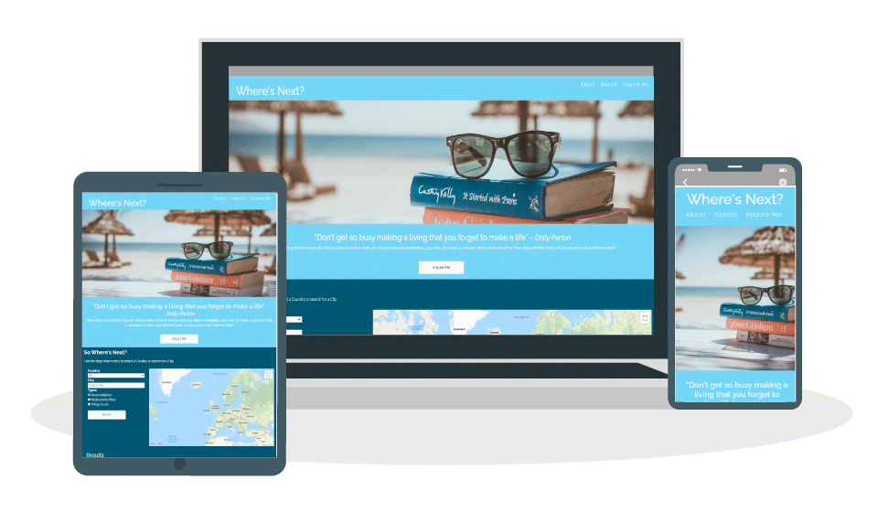

# MSP2 Where's Next?  Website

This is the Website for [Where's Next?](https://leeap83.github.io/Where-s-Next-/.) Where's next is a site that allows users to search for their next holiday destinations, by using google maps users can find accommodation and with Google Places they can also find places to eat and top attractions nearby. 

## User Experience (UX)

This Website has been designed for Couples, families, Single adults, teens and anyone who wants to leave there cares behind and discover somewhere new. By using Where's next the user can find inspiration from recommeneded destinations or they can use the search feature to find their ideal location.

**User stories**

**External User Goals:**
* Find the best holiday destination for their needs.

**Site Owner's Goals:**
*  Get users to choose a travel package from this site and/or from its sponsors.
*  Allow users to select/search a city and see a map showing attractions, accommodation & restaurants.
*  Display results that are visually appealing and user friendly.

**Design**
*  Colour Scheme   

    The colour scheme for each section has been chosen to relate to the colours in the main image.
    - #75d7f5 is used for the main background.
    - RGB (  0, 87,113) used for the map search Section.
    - RGB (279,155,136) used for the popular destinations section.
    

*  Typography
    
    The font Raleway has been used throughout with Sans Serief as an alternative.
    
*  Imagery

    The main image has been chosen to be eye catching and clearly explains what the website is about.
    The images for the popular destinations have been chosen to attract the users. 

    
* Wireframes
[Where's Next? Wireframe](docs/Where'snext.pdf)
 

 ## Features

 * Responsive on all devices - The site is designed to be responsive for desktop and Mobile devices.
 * Google Maps API - The inclusion of Google Maps to the Website allows users to visually see the location they select.
 * Google Places - Places allows the users to access points of interest, this has been restricted to the city selected in the autocomplete.  
 * Info Window - An infowindow has been added so when a user clicks on a marker a popup window appears showing the place details.
 * Results table - When a user selects a city a table of the results appears below the map showing the user the name of the places and relevent marker.
 * Popular destination - A section has been included of popular destinations to inspire the user.
 * Buttons & Navbar - The Navbar and buttons have been linked to take you to the specific area of the page to allow users to navigate easy.

## Future Development

The addition of a search here button on the map to allow users to find hotels, restaurants & things to do on any area of the map. 

 ## Technologies Used
 
 **Languages Used** 

 * HTML5
 * CSS3
 * JavaScript

**Frameworks, Libraries & Programs Used**

1. [Bootstrap 4.5.2](https://getbootstrap.com/): 
 Bootstrap was used with to assist with styling and responsiveness of the website.

2. [Font Awesome](https://fontawesome.com/):
 Font Awesome was used to provide the Icons throughout this website.

3. [Google Fonts](https://fonts.google.com/):
 Google fonts was used to import the font into the style.css file

4. [JavaScript](https://www.javascript.com/):
 JavaScript was used to write scripts for the Google Maps Api and the country/City search function.

5. [Git](https://git-scm.com/): 
 Git was used by utilizing the Gitpod terminal to commit to Git and push to GitHub

6. [GitHub](https://github.com/):
 GitHub was used to create a repository and store the code after it was pushed from Git.

7. [Balsamiq](https://balsamiq.com/):
 Wireframes were created using Balsamiq

8. [Pixabay](https://pixabay.com/):
 Pixabay was used to source all imagery for the webpage.

## Testing

The Website was manually tested on Internet Explorer, Google Chrome, Firefox and Safari and on an Iphone. The site is expected to bring back hotel, 
restaurants and things to do when a user selects a country and a city. The site was tested by selecting different countries and cities and 
[results](assets/images/results.png) were retuned.

A selection of devices was used to test the website and the mobile responsiveness.

The Freeformatter HTML Validator, W3C CSS Validator and JSHint were used to validate every page of the project to ensure there were no errors in the project.

[CSS Validator](http://jigsaw.w3.org/css-validator/) - [Results](docs/CSS-Validation.pdf)

[HTML Validator](https://validator.w3.org/) - [Results](docs/HTML-Validation.pdf)

[JSHint](https://jshint.com/) 

**Testing User Stories**

**External User Goals:**
* Find the best holiday destination for their needs.

    The website uses Google Maps, Google Places and radio buttons to allow the user to [search](assets/images/search.png)
    for their best destination.

**Site Owner's Goals:**
*  Get users to choose a travel package from this site and/or from its sponsors.

    An [inspire me](assets/images/destinations.png) section was added to inspire users to choose a travel package, 
    the info-window allows the users to click on the [hyperlink](assets/images/hyperlink.png) and can see prices and booking details. 

*  Allow users to select/search a city and see a map showing attractions, accommodation & restaurants.

    The user can utilise the [country](assets/images/country.png) and/or the [city](assets/images/city.png) to select their 
    destination. Then using the radio buttons they can filter between hotels, restaurants and things to do.

*  Display results that are visually appealing and user friendly.

    Multiple markers drop onto the map and provide user with location of the places. A [results](assets/images/results.png) 
    table matches the marker with the name of the place found and an info window pops up when marker clicked.

## Bugs

*  When the reset button is clicked the map, country and city retuns to original state but the radio buttons don't reset.
This has been left unfixed as the user can toggle between the radio buttons when next city is selected.

## Deployment 

The project was deployed to GitHub Pages using the following steps...

1. Log in to GitHub and locate the GitHub Repository
2. At the top of the Repository click the "Settings" button on the menu.
3. On the Settings page locate the "GitHub Pages" Section.
4. Under "Source", click the dropdown called "None" and select "Master Branch".
5. Now above the "GitHub Pages" section the published site link will be displayed.

## Forking the GitHub Repository

Forking the GitHub repository allows you to create a copy of the original on your GitHub account where you can view or make changes without changing the original. To fork a repository you need to...

1. Log in to GitHub and locate the GitHub Repository
2. At the top of the Repository click the "Settings" button on the menu.
3. On the settings page locate the "Fork" button.
4. A copy should now be in your GitHub account.

## Creating a Local Clone

To make A local clone follow these steps...

1. Log in to GitHub and locate the GitHub Repository
2. Under the repository name, click "Clone or Download".
3. Click the "Clone with HTTPS" and copy the link.
4. Open Git Bash and change the working directory to the location where the clone will be copied to.
5. Type "git clone" and then paste the URL and press enter. and a clone will be created.

## Credits

**Code**
* [Bootstrap4:](https://getbootstrap.com/) Bootstrap was used throughout the project to ensure the website was responsive.

* [Google Developers](Https://developers.google.com/maps/documentation/javascript/overview:) was used as refrence for google maps/places & search facility.

* YouTube & [W3Schools](https://www.w3schools.com/) were used to assit in the JavaScript coding to enable the reset button. 

**Content & Media**

Images were sourced from [Pixaby](https://pixabay.com/) and the authours are: 

- [Main Image](https://pixabay.com/photos/books-reading-beach-vacation-918521/) - image by free-photos from Pixabay
- [Amalfi coast](https://pixabay.com/photos/amalfi-amalfi-coast-coast-cliff-2254776/) - image by Anemone from Pixabay
- [New York](https://pixabay.com/photos/usa-new-york-manhattan-view-1778524/) - image by Jo Wiggijo from Pixabay
- [Cancun](https://pixabay.com/photos/sea-beach-cancun-mexico-vacations-931734/) - Image by aladecuervo from Pixabay 
- [Paris](https://pixabay.com/photos/bird-couple-beak-paris-2590901/) - Image by StockSnap from Pixabay 
- [Switzerland](https://pixabay.com/photos/winter-hochybrig-4697776/) -Image by Jörg Vieli from Pixabay
- [Maldives](https://pixabay.com/photos/maldives-beach-holiday-ocean-666122/) - Image by romaneau from Pixabay  

**Acknowledgements**

* My Mentor Aaron Sinnott for feedback
* Code Institute for training
* WS3 schools for reference on coding issues
* YouTube online tutorials used when encountered coding issues
* Google Maps Platforms for tutorials
 
