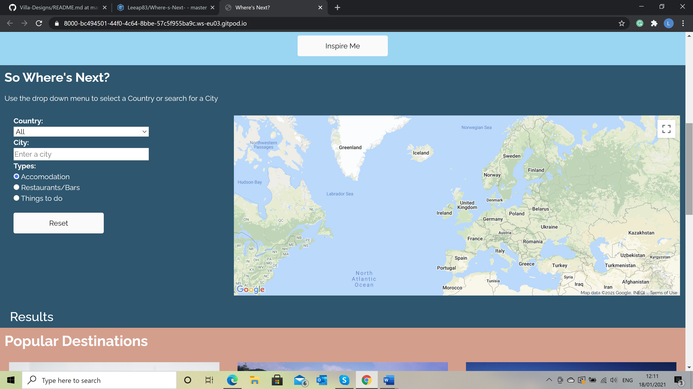
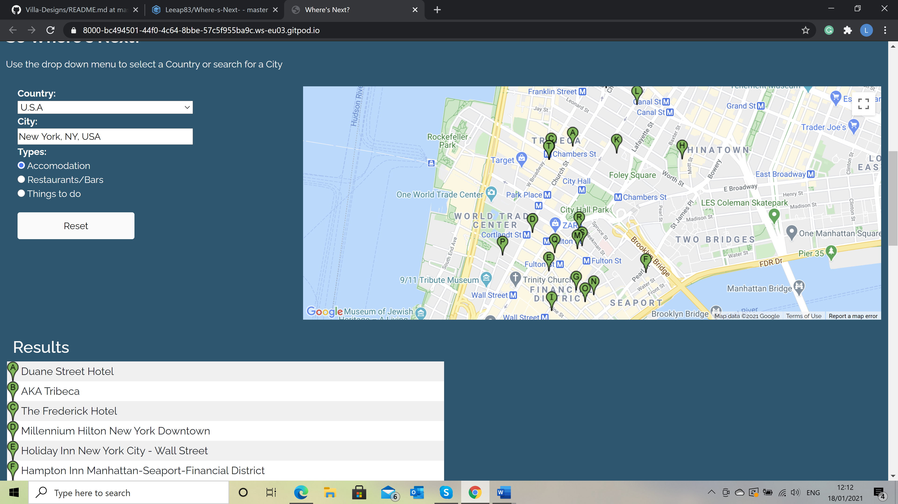
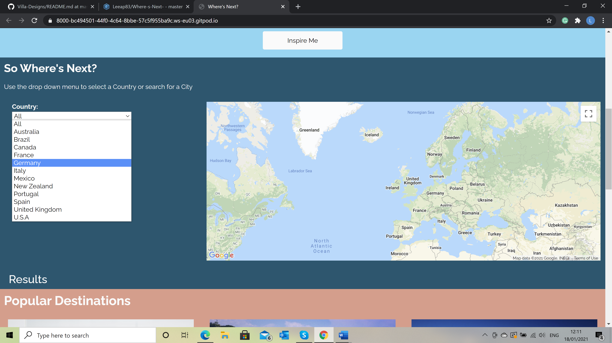
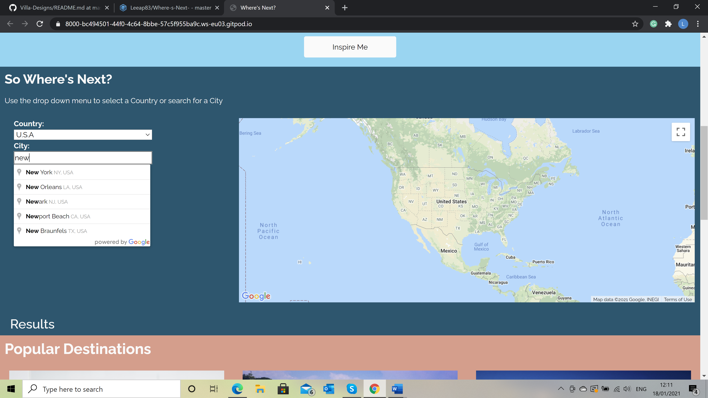

# MSP2 Where's Next?  Website

This is the Website for [Where's Next?](https://leeap83.github.io/Where-s-Next-/.) Where's next is a site that allows users to search for their next holiday destinations, by using google maps users can find accommodation and with Google Places they can also find places to eat and top attractions nearby. 

## User Experience (UX)

This Website has been designed for Couples, families, Single adults, teens and anyone who wants to leave there cares behind and discover somewhere new. By using Where's next the user can find inspiration from recommeneded destinations or they can use the search feature to find their ideal location.

**User stories**

**External User Goals:**
* I want to be able to access and navigate the site easily.
* I want to find the best holiday destination for my needs.
* I want to be able to choose from a choice of destinations.
* I want to see Hotels, places to Eat and attractions in relevent destination i choose.

**Site Owner's Goals:**
*  Allow users to easily navigate the site.   
*  Allow users to choose a travel package from this site and/or from its sponsors.
*  Allow users to select a country to find a city.
*  Allow users to find cities in the selected country.  
*  Allow and see a map showing attractions, accommodation & restaurants.
*  Allow users to view results that are visually appealing and user friendly.
*  Allow users to access site on multiple devices.

**Design**
*  Colour Scheme   

    The colour scheme for each section has been chosen to relate to the colours in the main image.
    - #75d7f5 is used for the main background.
    - RGB (  0, 87,113) used for the map search Section.
    - RGB (279,155,136) used for the popular destinations section.
    

*  Typography
    
    The font Raleway has been used throughout with Sans Serief as an alternative.
    
*  Imagery

    The main image has been chosen to be eye catching and clearly explains what the website is about.
    The images for the popular destinations have been chosen to attract the users. 

    
* Wireframes
[Where's Next? Wireframe](docs/Where'snext.pdf)
 

 ## Features

 * Responsive on all devices - The site is designed to be responsive for desktop and Mobile devices.
 * Google Maps API - The inclusion of Google Maps to the Website allows users to visually see the location they select.
 * Google Places - Places allows the users to access points of interest, this has been restricted to the city selected in the autocomplete. 
 * Markers - Markers were created to drop on to the map when a city is choosen.
 * Radio buttons - Radio buttons were added to allow users to choose what they want to search for. 
 * Info Window - An infowindow has been added so when a user clicks on a marker a popup window appears showing the place details.
 * Results table - When a user selects a city a table of the results appears below the map showing the user the name of the places and relevent marker.
 * Popular destination - A section has been included of popular destinations to inspire the user.
 * Buttons & Navbar - The Navbar and buttons have been linked to take you to the specific area of the page to allow users to navigate easy.
 * Reset button - The reset button allows users to clear the previous search fields.

## Future Development

The addition of a search here button on the map to allow users to find hotels, restaurants & things to do on any area of the map. 

 ## Technologies Used
 
 **Languages Used** 

 * HTML5
 * CSS3
 * JavaScript

**Frameworks, Libraries & Programs Used**

1. [Bootstrap 4.5.2](https://getbootstrap.com/): 
 Bootstrap was used with to assist with styling and responsiveness of the website.

2. [Font Awesome](https://fontawesome.com/):
 Font Awesome was used to provide the Icons throughout this website.

3. [Google Fonts](https://fonts.google.com/):
 Google fonts was used to import the font into the style.css file

4. [JavaScript](https://www.javascript.com/):
 JavaScript was used to write scripts for the Google Maps Api and the country/City search function.

5. [Git](https://git-scm.com/): 
 Git was used by utilizing the Gitpod terminal to commit to Git and push to GitHub

6. [GitHub](https://github.com/):
 GitHub was used to create a repository and store the code after it was pushed from Git.

7. [Balsamiq](https://balsamiq.com/):
 Wireframes were created using Balsamiq

8. [Pixabay](https://pixabay.com/):
 Pixabay was used to source all imagery for the webpage.

## Testing

The Freeformatter HTML Validator and W3C CSS Validator were used to validate every page of the project to ensure there were no errors in the project.

[CSS Validator](http://jigsaw.w3.org/css-validator/) - [Results](docs/CSS-Validation.pdf)

[HTML Validator](https://validator.w3.org/) - [Results](docs/HTML-Validation.pdf)

[JSHint](https://jshint.com/) was used to validate the JavaScript 

Lighthouse in Google Chrome developer tools was used to test the websites performance, quality and correctivness for both
[Desktop](docs/lighthouse-desktop.pdf) and [Mobile](docs/lighthouse-mobile.pdf)

**Manual Tests for functionality of features**
    
* Responsive on all devices - Chrome Dev Tools was used to check the sites compatiability all all devices. 
A link to the site was tested on iphone and ipad.
* Google Maps API - As soon as the initmap and the CSS style was added the website was checked to see if the map
loaded properly. 
* Google Places autocomplete - The autocomplete search field was added, styled and the javascript code was completed
the field box was checked to see if it worked with and without a country selected.
The cities is restricted to cities in the specific country if selected, if country is left on All then any city can be selected.
* Markers - I checked that after a city was selected for each country that markers appeared on the map and 
the matching results appeared in the results table under the web page. This was tested for multiple cities and for the types.
* Radio buttons - the radio buttons were toggled on various cities to ensure that the correct results were returned for 
the correct type selected.
* Infowindow - When user clicks on the marker the place info appears with details and a hyperlink to google places so the user can book
accommodation, restaurants or attractions. The infowindow was tested by clicking on randomly selected hotels, restaurants and attractions. 
* Results table - When the user selects a city a results table appears underneath the search field this was tested on cities to return
hotel, restaurants and attractions with corresponding marker letter to those on maps. 
* Buttons & Navbar - The buttons and the navbar allow users to be taken to different areas of the site, each button was clicked on to 
check if they worked and users are taken to the correct section.
* Reset button - The reset button allows users to clear the search fields, this was tested on reseting the country, city and radio buttons.
The button works and resets the map, markers, the country and the city. The radio buttons dont reset back to accomodation, this has been highlighted 
as a bug and the decision to not fix is explained.    

**Testing User Stories**

**External User Goals:**
* I want to be able to access and navigate the site easily.
    
    (a)  A nav bar was added to allow the user to be able to navigate to each section of the page.

    (b)  Buttons are added to each section to move to desired section of the site.

* I want to find the best holiday destination for my needs.

    (a)  Google Maps API and places libraries was added to allow users the ability to find their ideal holiday.

    (b)  A list of popular destinations was added to give the user inspiration for their destination.

* I want to be able to choose from a choice of destinations.

    (a)  A drop down list of countries was added based on popular countries to allow users to narrow their search.

    (b)  Autocomplete feature was added for cities allowing the user to select a city of their choice.

    (c)  Markers drop on the map to show users a cjhoice of hotel, restaurants and attractions.
    
* I want to see Hotels, places to Eat and attractions in relevent destination I choose.

    (a)  Google Places Library was added to the API key to allow users to find places nearby

    (b)  Radio buttons were added so the users can alternate between hotels, restaurants and attractions.

    (c)  An infowindow shows the destination details and ratings allowing users the ability to select from a choice.

**Site Owner's Goals:**
*  Allow users to easily navigate the site. 

    (a)  A nav bar was added to allow the user to be able to navigate to each section of the page, these were tested to ensure that when 
    clicked the user was taken to the correct section.    

    (b)  Buttons are added to each section to move to desired section of the site, these were tested to ensure that when 
    clicked the user was taken to the correct section.
    
    

*  Allow users to choose a travel package from this site and/or from its sponsors.

    (a)  Users can find their next holiday destination through the search feature by selecting a country and by entering a city.
         
    (b)  When users select the country and city markers appear on the map with an info window. 
         
    (c)  Users can click on hyperlink in the infowindow of the place they find to book through google.com/maps/places 

*  Allow users to select a country to find a city.

    (a)  A selection of countries was included in a dropdown menu to allow users to narrow their search.
        
    
*  Allow users to find cities in the selected country.  

    (a)  Google places autocomplete feature was added to give users the type-ahead-search behavior of the Google Maps in
    the city search field. 

    (b)  JavaScript code was added to restrict the autocomplete so when a country is selected only cities for that country
    can be selected, this was tested by searching for cities for each country that aren't in that country.

*  Allow and see a map showing attractions, accommodation & restaurants.

    (a)  Google Maps function was added to the site which displays results based on user input.

    (b)  Radio buttons were added to the site which allows users to alterante between each type.

    (c)  Place changed function was added on click would return different results based on which button was clicked.

*  Allow users to view results that are visually appealing and user friendly.

    (a)  The markers drop on to the map with alphabetical markers similar to google maps.

    (b)  The infowindow was designed to display the detail in a visualy familiar way so users have a familiar experience.

    (c)  When the user selects the city a results table appears with a list of names of the places with a mathing 
    alphabetical marker to those on the map.

*  Allow users to access site on multiple devices.

    (a)  The webstie has been designed and tested to respond on multiple devices. The site was tested mainly with 
    Chrome developer tools and the responsiveness was tested for multiple devices and screen widths.

    (b)  The site was tested on iphone and on an ipad. 

## Bugs

*  When the reset button is clicked the map, country and city retuns to original state but the radio buttons don't reset.
This has been left unfixed as the user can toggle between the radio buttons when next city is selected.

*  During the lighthouse audit, the performance on desktop and mobile could be improved by using next-gen formats for the images which means
faster downloads and less data consumption. The images as I am unfamiliar with next-gen formats and these formats arent compatible with all
browsers. 

## Deployment 

The project was deployed to GitHub Pages using the following steps...

1. Log in to GitHub and locate the GitHub Repository
2. At the top of the Repository click the "Settings" button on the menu.
3. On the Settings page locate the "GitHub Pages" Section.
4. Under "Source", click the dropdown called "None" and select "Master Branch".
5. Now above the "GitHub Pages" section the published site link will be displayed.

## Forking the GitHub Repository

Forking the GitHub repository allows you to create a copy of the original on your GitHub account where you can view or make changes without changing the original. To fork a repository you need to...

1. Log in to GitHub and locate the GitHub Repository
2. At the top of the Repository click the "Settings" button on the menu.
3. On the settings page locate the "Fork" button.
4. A copy should now be in your GitHub account.

## Creating a Local Clone

To make A local clone follow these steps...

1. Log in to GitHub and locate the GitHub Repository
2. Under the repository name, click "Clone or Download".
3. Click the "Clone with HTTPS" and copy the link.
4. Open Git Bash and change the working directory to the location where the clone will be copied to.
5. Type "git clone" and then paste the URL and press enter. and a clone will be created.

## Credits

**Code**
* [Bootstrap4:](https://getbootstrap.com/) Bootstrap was used throughout the project to ensure the website was responsive.

* [Google Developers](Https://developers.google.com/maps/documentation/javascript/overview:) was used as refrence for google maps/places & search facility.

* YouTube & [W3Schools](https://www.w3schools.com/) were used to assit in the JavaScript coding to enable the reset button. 

**Content & Media**

Images were sourced from [Pixaby](https://pixabay.com/) and the authours are: 

- [Main Image](https://pixabay.com/photos/books-reading-beach-vacation-918521/) - image by free-photos from Pixabay
- [Amalfi coast](https://pixabay.com/photos/amalfi-amalfi-coast-coast-cliff-2254776/) - image by Anemone from Pixabay
- [New York](https://pixabay.com/photos/usa-new-york-manhattan-view-1778524/) - image by Jo Wiggijo from Pixabay
- [Cancun](https://pixabay.com/photos/sea-beach-cancun-mexico-vacations-931734/) - Image by aladecuervo from Pixabay 
- [Paris](https://pixabay.com/photos/bird-couple-beak-paris-2590901/) - Image by StockSnap from Pixabay 
- [Switzerland](https://pixabay.com/photos/winter-hochybrig-4697776/) -Image by Jörg Vieli from Pixabay
- [Maldives](https://pixabay.com/photos/maldives-beach-holiday-ocean-666122/) - Image by romaneau from Pixabay  

**Acknowledgements**

* My Mentor Aaron Sinnott for feedback
* Code Institute for training
* WS3 schools for reference on coding issues
* YouTube online tutorials used when encountered coding issues
* Google Maps Platforms for tutorials
 
